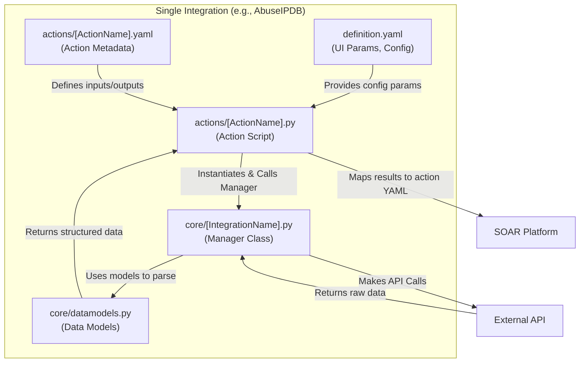

# Content Hub - AI Agent Guide

Welcome, AI Agent! This `AGENTS.md` file is the "Single Source of Truth" for understanding this repository, its architectural patterns, and its development workflows.

**Note:** This file is named `AGENTS.md` according to Google's standard for agent configuration files.

## 📁 Repository Structure

| Directory         | Purpose                                                                                                 |
| :---------------- | :------------------------------------------------------------------------------------------------------ |
| `/content/`       | Contains the core business logic, including `playbooks` and `response_integrations` (e.g., `third_party/community`, `google`). |
| `/packages/`      | Core framework libraries and shared testing utilities (e.g., `envcommon`, `tipcommon`, `mp`, `integration_testing`). |
| `/docs/`          | Project documentation, guidelines (`getting_started`, `content_deep_dive`), and SDK/Tooling reference (`tools_and_sdk`). |
| `/.agents/`       | Configuration and custom skills for AI coding agents working in this workspace.                         |
| `/.gemini/`       | Contains workspace-specific rules like the AI `styleguide.md` which must be strictly enforced.          |
| `/.github/`       | CI/CD workflows defining testing, linting, and build validation (e.g., `test.yml`, `lint.yml`).         |

## 🛑 Strict Command Execution & Safety Rules (Mandatory)

1. **User Approval & Analysis Required**: AI Agents MUST propose terminal commands and wait for user review, analysis, and explicit approval before executing non-read-only terminal commands or state-changing operations.
2. **STRICT Prohibition of Destructive Git Commands**: AI Agents are STRICTLY FORBIDDEN from executing `git reset --hard`, `git reset --hard origin/`, `git clean -f`, or any other destructive Git commands that discard local modifications, untracked files, or workspace state. Always preserve local modifications and untracked files.


## 🧩 Architectural Patterns & Interaction

This repository implements SOAR (Security Orchestration, Automation, and Response) integrations.

A standard integration (e.g., `content/response_integrations/third_party/community/AbuseIPDB`) is structured as follows:
*   **`definition.yaml`**: The top-level configuration. It defines the core UI parameters required by the integration (e.g., `Api Key`, `Verify SSL`) and its categorization.
*   **`actions/`**: Contains the individual capabilities of the integration.
    *   `[ActionName].yaml`: Defines the action metadata, inputs, and expected outputs/results.
    *   `[ActionName].py`: The execution script that runs when the action is triggered.
*   **`core/`**: Houses the core logic.
    *   `[IntegrationName].py` (e.g., `AbuseIPDB.py`): The main Manager class that wraps the external API calls.
    *   `datamodels.py`: Defines the data models and classes used by the integration to parse API responses.
*   **`tests/`**: Contains unit and integration tests (e.g., `test_imports.py` inside `test_defaults`).
*   **`pyproject.toml` / `uv.lock`**: Integrations define their dependencies in `pyproject.toml` and lock them via `uv`.

**Interaction Flow:**
The UI contract defined in `actions/[ActionName].yaml` specifies the inputs provided to `actions/[ActionName].py`. The action script typically instantiates the Manager class from `core/[IntegrationName].py` using credentials and endpoints derived from `definition.yaml` UI parameters. It performs the core business logic (calling external APIs), wraps the responses using `datamodels.py`, and maps the outputs into the result fields defined in the action YAML.



## 🛠️ Development Workflows

### Dependency Management
The repository heavily leverages `uv` for modern, fast package management and virtual environment resolution. Each integration typically has its own `pyproject.toml` pointing to standard local sibling packages like `tipcommon` and `environmentcommon`.

### Testing Workflows
Testing is orchestrated via a custom multi-processing CLI validation tool called `mp`.
*   **Run All Integration Tests**:
    ```bash
    # Ensure you are at the repository root
    mp config --root-path . --processes 10 --display-config
    mp test --repository third_party --raise-error-on-violations
    ```
*   **Run Tests for a Specific Integration Type**:
    ```bash
    # Example: Running tests for all 'third_party' integrations
    mp config --root-path . --processes 10 --display-config
    mp test --repository third_party --raise-error-on-violations
    # Example: Running tests for all 'google' integrations
    mp test --repository google --raise-error-on-violations
    ```
*   **Run Tests for a Single Integration (e.g., `abuse_ipdb`)**:
    *   **Rule of Thumb:** Always use the exact folder name of the integration (**`snake_case`**) flag for the `--integration` argument. Do not use CamelCase or positional arguments.
    ```bash
    mp config --root-path . --processes 10 --display-config
    mp test --integration abuse_ipdb --raise-error-on-violations
    ```

### Local Dev-Env Deployment (`mp dev-env`)
To test integrations on a real local SOAR environment, use the modern, native `mp` commands executed via `uv` (or global `mp` once installed).

1.  **Login to the environment**: (This only needs to be done once to save credentials)
    *   Get the API Root inside SOAR by running `localStorage['soar_server-addr']` in the browser JS console.
    *   Get an API Key in SOAR Settings -> Advanced -> API Keys (Admins group).
    *   Use the `--no-verify` option to natively bypass TLS/SSL self-signed certificate check issues without needing any patch scripts!
    ```bash
    uv run --project packages/mp mp login --api-root "https://localhost" --api-key "YOUR_KEY" --no-verify
    ```
2.  **Push an Integration**: Push your local code directly to the SOAR server.
    *   **Rule of Thumb:** Use the exact folder name in **`snake_case`** (e.g., `git_sync`, `telegram`). You do not need `dev-env` prefix in modern commands.
    ```bash
    uv run --project packages/mp mp push integration git_sync
    ```

**Troubleshooting Build/Push Hangs (`Restructuring dependencies`):**
If `mp push` or `mp build` hangs indefinitely at the `Restructuring dependencies` step, it is likely because `uv`/`pip` is silently prompting for Artifact Registry credentials in the background (due to internal Google dependencies).
*   **Fix:** Ensure the `keyrings.google-artifactregistry-auth` package is installed directly into the `mp` tool's isolated virtual environment.
    ```bash
    cd packages/mp && uv tool install --with keyrings.google-artifactregistry-auth -e . --force
    ```

**Fixing Dependency Resolution Issues (Missing Wheels):**
If `mp build` or `mp push` fails during the `Restructuring dependencies` or dependency resolution phase because a specific package version (e.g., `certifi`, `cryptography`, `signalsciences`) cannot be found or is incompatible with the internal Google mirror:
*   **Fix:** Prefix the command with `PIP_INDEX_URL=https://pypi.org/simple` to allow fetching missing wheels from the public PyPI registry.
    ```bash
    PIP_INDEX_URL=https://pypi.org/simple uv run --project packages/mp mp push integration signal_sciences
    ```

**Troubleshooting SSL Errors during Push (`CERTIFICATE_VERIFY_FAILED`):**
The modern `mp` tool has native SSL verification bypass.
*   **Fix:** Always use the `--no-verify` option during login (`mp login --no-verify`).
*   **Note:** The legacy `restore_dev_state.py` script is deprecated and no longer needed to patch `api.py` for SSL bypass!


### Build & Linting Workflows
Linting is managed via `ruff` and type-checking via `ty`, and also executed via the `mp` tool for integrations.
*   **Linting Changed Files in an Integration Type**:
    ```bash
    mp config --root-path . --processes 10 --display-config
    # Example: Linting changed files within 'third_party' integrations
    mp check --repository third_party --changed-files --raise-error-on-violations --output-format grouped
    # Example: Linting changed files within 'google' integrations
    mp check --repository google --changed-files --raise-error-on-violations --output-format grouped
    ```
*   **Linting a Specific Integration (e.g., `abuse_ipdb`)**:
    ```bash
    mp config --root-path . --processes 10 --display-config
    mp check content/response_integrations/third_party/community/abuse_ipdb --raise-error-on-violations --output-format grouped
    ```
*   **Linting Core Packages**: Uses standard `ruff check --output-format grouped`, `ty check`, and `pyrefly check` within the respective package directories (`packages/mp`, `packages/envcommon`, etc.).

### 🚨 Pre-Commit Verification Checklist for AI Agents (Mandatory)
Before creating any commit or pushing changes to the repository, AI Agents **MUST** execute the complete suite of linters, static analyzers, type checkers, and unit tests for modified packages.

**Required Pre-Commit Sequence for `packages/mp`:**
```bash
cd packages/mp
uv run ruff check src/ tests/
uv run ty check
uv run pyrefly check
uv run pytest
```
* **Ruff**: Must pass with 0 errors (`All checks passed!`).
* **Ty**: Must pass with 0 errors (`All checks passed!`).
* **Pyrefly**: Must pass with 0 errors/warnings (`0 errors`).
* **Pytest**: All unit tests must pass.


### Helper Scripts

*   **`restore_dev_state.py`**: A script in the repository root used to patch the `mp` tool for a better local development experience. It performs the following modifications:
    *   **Disables SSL Verification**: Patches `packages/mp/src/mp/dev_env/api.py` to ignore self-signed certificates when pushing to local SOAR environments.
    *   **Ignores Cache Files**: Patches `packages/mp/src/mp/core/file_utils/common/file_utils.py` to skip `.pyc` files and `__pycache__` folders during file operations.
    *   **Formats Python Files**: Patches `packages/mp/src/mp/build_project/restructure/integrations/code.py` to automatically format Python files during the build/restructure process.


## 📝 Coding Standards & Styleguide (Critical)

AI Agents **MUST** strictly adhere to all rules defined in `/.gemini/styleguide.md`. Load and apply these guidelines before performing any code modifications or generation.

In addition to the detailed rules in `/.gemini/styleguide.md`, key principles include:

1.  **Security & Reliability**:
    *   Use `pathlib.Path` for all path manipulations (e.g., `Path("my/file.txt")` instead of `"my/" + "file.txt"`).
    *   Use `yaml.safe_load()` instead of `yaml.load()`.
    *   Never use `subprocess.run(..., shell=True)` and avoid `eval()`/`exec()`.
    *   Do not log PII, API keys, or tokens.

2.  **Modern Python & Types**:
    *   Prefer Asyncio (`async`/`await`) for network-bound logic (`aiohttp`, `httpx`). Do not use blocking `time.sleep()`.
    *   All functions must have strict type hints using modern union syntax (e.g., `str | None`).

3.  **Docstrings**:
    *   Follow Google Style docstrings (e.g., using `Args:`, `Returns:`, `Raises:`). See [Google Python Style Guide](https://engdoc.corp.google.com/eng/doc/devguide/py/style/index.md) for details.
    *   Do not duplicate type hints in the docstring if already present in the function signature.
    *   **Must** include a `Raises` section documenting intentionally raised exceptions.

4.  **Testing (Golden Tests)**:
    *   When generating Unit Tests, **must** model them after "Golden Tests" found in:
        *   `content/response_integrations/third_party/telegram/tests/`
        *   `content/response_integrations/third_party/sample_integration/tests/`
    *   **Never** make real network calls in unit tests; strictly mock API responses.

5.  **JSON Result Validation**:
    *   If an action returns a JSON result (e.g., calling `result.add_result_json(...)` or assigning to `self.soar_action.json`), a corresponding JSON example file **MUST** be present in the integration's `resources/` directory (e.g., `resources/[action_name]_json_example.json`). If an agent generates code that returns JSON without an example, it **MUST** warn the user and generate a placeholder JSON example file in the correct location.

6.  **Inclusive Language**:
    *   **Must not** use terms like `Whitelist`, `Blacklist`, `White list`, or `Black list` for variables, classes, properties, or file names.
    *   **Must** use inclusive alternatives such as `AllowList` and `BlockList`.
    *   The only exception is when dealing with external API endpoints or data payloads that strictly require the legacy terminology (e.g., calling an endpoint `/api/whitelist`).

## 🤖 Custom Agent Skills and Trigger Guidelines

You have access to specialized skills in your `.agents/skills/` directory. You **must** utilize these skills according to the nature of your task. Always trigger the view_file tool on the `SKILL.md` file for comprehensive instructions when these conditions apply.

### 1. `skill-creator`
*   **Trigger Condition:** Use when building new skills, updating existing skills, or managing skill life cycles.

### 2. `soar-code-review`
*   **Trigger Condition:** Use when asked to perform a code review or re-review of a CL or PR for SOAR integrations.

### 3. `soar-integration-testing`
*   **Trigger Condition:** Use when running and fixing tests for existing and new response integrations, or diagnosing import errors.

### 4. `soar-new-integration-scaffold`
*   **Trigger Condition:** Use when building a new integration from scratch to scaffold the directory structure.

### 5. `soar-test-structure`
*   **Trigger Condition:** Use when creating or updating tests for an integration to ensure they follow the "Golden Tests" pattern.

## 🔄 Agent Lifecycle Workflows

### The `/start` Workflow (Context Hydration)
When the `/start` event is triggered for a new session or task, you must:
1. **Internalize Architecture:** Read and memorize this `AGENTS.md` to understand the project structure, testing patterns, and Wiki system.
2. **Pre-load Wiki Context:** Query the `.llm-wiki/` for existing context on this integration or task using the `llm-wiki` skill before writing any code. If the task involves a Buganizer ID, create a new task source folder in the wiki.

### The `/final` Workflow (Exit Criteria)
Before finalizing the task or exiting:
1. **Validation Checks:** Run the validation checks using the `llm-wiki` skill (which executes `validate_wiki.py`) to ensure local wiki and index structure integrity.
2. **LLM-Wiki Sync:** Ensure task details, edge cases, and compounded knowledge are synthesized in `.llm-wiki/wiki/tasks/<TaskID>.md`.

## 🔄 Continuous Improvement

This `AGENTS.md` file is a living document!

**Instructions for Future Agents:**
Whenever you identify a new architectural pattern, a newly adopted build tool, or an outdated command, you are highly encouraged to **update this file proactively**. Ensuring this guide reflects the exact current state of the repository will significantly improve the efficiency of all future AI operations.
